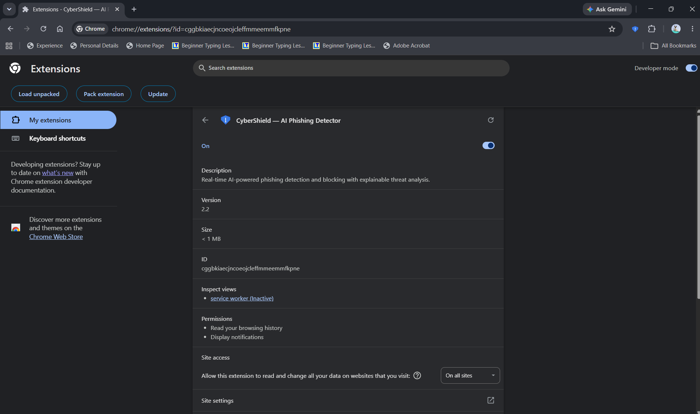
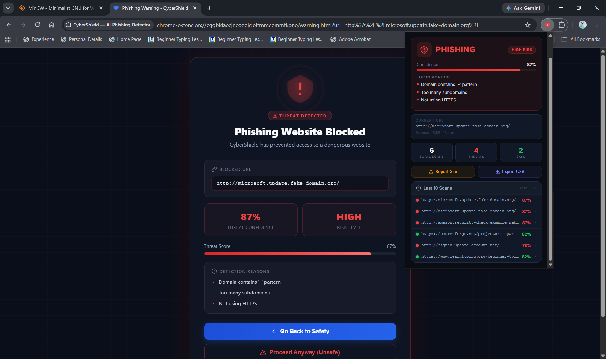
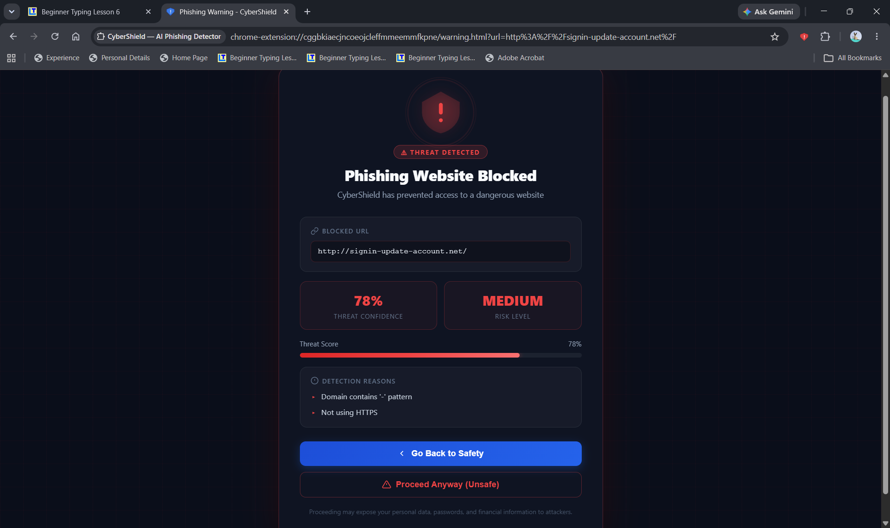
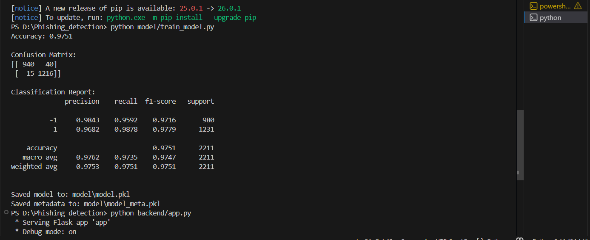

# CyberShield: AI-Based Phishing Website Detection Browser Extension

> Final Year Project | Chrome Extension + Flask Backend + Random Forest ML Model

---

## Project Overview

CyberShield is a real-time phishing website detection system built as a Chrome browser extension. When a user visits any website, the extension automatically extracts features from the URL, sends them to a local Flask API, and a trained Random Forest model predicts whether the site is **phishing** or **legitimate**. If phishing is detected, the user is immediately redirected to a warning page and blocked from accessing the site.

---

## Tech Stack

| Layer | Technology |
|---|---|
| Browser Extension | Chrome Extension (Manifest V3), HTML, CSS, JavaScript |
| Backend API | Python, Flask, Flask-CORS |
| Machine Learning | Scikit-learn (Random Forest Classifier) |
| Data Processing | Pandas, NumPy |
| Model Persistence | Joblib |
| Dataset | UCI Phishing Websites Dataset (11,055 samples, 30 features) |

---

## Project Structure

```
Phishing_detection/
│
├── backend/
│   ├── app.py                  # Flask API — /predict and /report endpoints
│   └── feature_extraction.py   # URL feature extractor (30 UCI features)
│
├── dataset/
│   └── phishing.csv            # UCI phishing dataset
│
├── model/
│   ├── train_model.py          # Model training script
│   ├── model.pkl               # Trained Random Forest model
│   └── model_meta.pkl          # Feature names metadata
│
├── extension/
│   ├── manifest.json           # Chrome Extension Manifest V3
│   ├── background.js           # Service worker — scans every tab, blocks phishing
│   ├── popup.html              # Extension popup UI
│   ├── popup.js                # Popup logic — status, history, report, export
│   ├── warning.html            # Phishing warning/blocking page
│   ├── warning.css             # Warning page styles
│   ├── warning.js              # Warning page logic
│   └── icons/                  # Shield icons (safe/phishing/unknown states)
│
├── reports/                    # Auto-created — stores reported URLs
│   ├── reported_urls.json
│   └── reported_urls.csv
│
├── requirements.txt
└── README.md
```

---

## How to Run

### Step 1 — Install Python dependencies

```bash
pip install -r requirements.txt
```

### Step 2 — Train the model (skip if model.pkl already exists)

```bash
python model/train_model.py
```

Output:
```
Accuracy: ~0.97
Confusion Matrix: ...
Classification Report: ...
Saved model to: model/model.pkl
```

### Step 3 — Start the Flask backend

```bash
python backend/app.py
```

Server runs at: `http://127.0.0.1:5000`

### Step 4 — Load the extension in Chrome

1. Open `chrome://extensions`
2. Enable **Developer mode** (top right)
3. Click **Load unpacked**
4. Select the `extension/` folder
5. The CyberShield icon appears in the toolbar

---

## How It Works — End to End

```
User visits URL
      ↓
background.js intercepts (chrome.tabs.onUpdated)
      ↓
POST /predict → Flask API
      ↓
feature_extraction.py extracts 30 URL features
      ↓
Random Forest model predicts: phishing / legitimate
      ↓
    PHISHING?                    LEGITIMATE?
      ↓                               ↓
Redirect to warning.html       Green badge "SAFE"
Show confidence + reasons      Store result in popup
Block the site
```

---

## API Endpoints

### `POST /predict`

```json
Request:  { "url": "http://paypal-login-secure.com/" }

Response: {
  "label":      "phishing",
  "confidence": 0.87,
  "riskLevel":  "High Risk",
  "reasons": [
    "Domain uses hyphens to mimic legitimate sites",
    "Website is not secured with HTTPS encryption"
  ]
}
```

### `POST /report`

```json
Request:  { "url": "...", "label": "phishing", "confidence": 0.87, "reasons": [...] }
Response: { "status": "reported", "message": "URL reported successfully" }
```

---

## Machine Learning Details

- **Dataset:** UCI Phishing Websites Dataset — 11,055 URLs, 30 features, balanced classes
- **Algorithm:** Random Forest Classifier
- **Parameters:** 120 trees, max depth 18, random state 42
- **Train/Test Split:** 80% / 20% (stratified)
- **Accuracy:** ~97%
- **Feature Encoding:** 1 = legitimate, -1 = phishing, 0 = unknown/suspicious

### Key Features Used

| Feature | What it detects |
|---|---|
| `having_IP_Address` | IP used instead of domain name |
| `URL_Length` | Abnormally long URLs |
| `Shortining_Service` | bit.ly, tinyurl etc. |
| `having_At_Symbol` | @ in URL to deceive browser |
| `Prefix_Suffix` | Hyphens in domain (paypal-secure.com) |
| `having_Sub_Domain` | Too many subdomains |
| `SSLfinal_State` | HTTP vs HTTPS |
| `HTTPS_token` | Fake "https" in domain name |

---

## Extension Features

| Feature | Description |
|---|---|
| Auto-scan | Every page load is scanned automatically |
| Phishing block | Redirects to warning page with reasons |
| Dynamic icons | Green/Red/Yellow shield based on result |
| Badge text | SAFE / RISK shown on extension icon |
| Popup UI | Status card, confidence bar, risk level |
| Scan history | Last 10 scans with collapsible details |
| Report site | Sends URL to backend, saved to CSV + JSON |
| Export CSV | Download full scan history |
| Desktop notification | Alert when phishing site is blocked |
| Rescan button | Manually re-scan current page |
| Stats counter | Total scans, threats found, safe sites |


## Screenshots

### Chrome Extension



CyberShield installed as a Chrome Manifest V3 extension.

---

### Safe Website Detection


Real-time analysis of legitimate websites with confidence scoring and indicator explanations.

---

### Dashboard & Scan History



Extension dashboard displaying scan statistics, phishing alerts, and recent scan history.

---

### Phishing Website Blocking



CyberShield automatically blocks suspicious websites and explains the detected threat indicators.

---

### Model Performance



Random Forest classifier evaluation results showing 97.51% accuracy, confusion matrix, and classification metrics.


## Key Achievements

- Achieved ~97% classification accuracy using Random Forest.
- Developed a real-time Chrome Extension using Manifest V3.
- Integrated Machine Learning with a Flask REST API.
- Implemented phishing blocking, confidence scoring, and scan history.
- Designed a user-friendly interface for cybersecurity awareness.

## Author

Anshita Gautam

BCA Graduate | Aspiring Software Developer

GitHub: https://github.com/Anshi1310
LinkedIn: https://linkedin.com/in/anshita13
